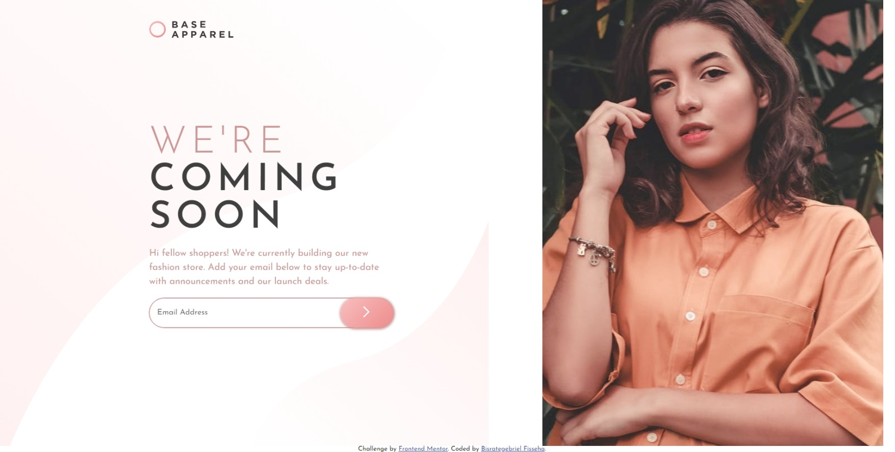
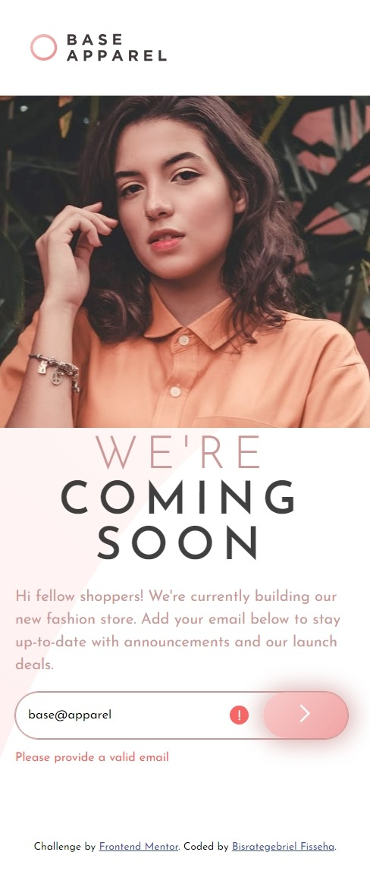

# Frontend Mentor - Base Apparel coming soon page solution

This is a solution to the [Base Apparel coming soon page challenge on Frontend Mentor](https://www.frontendmentor.io/challenges/base-apparel-coming-soon-page-5d46b47f8db8a7063f9331a0). Frontend Mentor challenges help you improve your coding skills by building realistic projects.

## Table of contents

- [Overview](#overview)
  - [The challenge](#the-challenge)
  - [Screenshot](#screenshot)
  - [Links](#links)
- [My process](#my-process)
  - [Built with](#built-with)
  - [What I learned](#what-i-learned)
  - [Continued development](#continued-development)
  - [Useful resources](#useful-resources)
- [Author](#author)
- [Acknowledgments](#acknowledgments)

## Overview

A minimalistic challenge yet a powerful one to learn foundational knowledge whether for first time or revising your skills.

### The challenge

Users should be able to:

- View the optimal layout for the site depending on their device's screen size
- See hover states for all interactive elements on the page
- Receive an error message when the `form` is submitted if:
  - The `input` field is empty
  - The email address is not formatted correctly

### Screenshot

### Links

- Solution URL: [Add solution URL here](https://your-solution-url.com)
- Live Site URL: [Add live site URL here](https://your-live-site-url.com)

## My process

I started working on the desktop design then proceed to the mobile design. Then I worked on the email validation and some other customization.

### Built with

- HTML5 markup
- CSS custom properties
- Flexbox
- CSS Grid
- Vanilla JavaScript

### What I learned

I have learnt more on how to interact with the Document Object Model(DOM). It made me explore the DOM world. I have also learnt how to work with CSS Grid and responsive design using the grid.

### Continued development

I will explore other CSS and JS frameworks and learn to be able do more complex layouts and logics.

### Useful resources

- [MDN Web Docs](https://developer.mozilla.org/en-US/) - This helped me when I was working on email validation and DOM manipulation.

## Author

- Frontend Mentor - [@Bisrategebriel](https://www.frontendmentor.io/profile/Bisrategebriel)
- Twitter - [@bisrate22Fish](https://www.twitter.com/bisrate22Fish)
- Medium - [@bisrate22](https://www.medium.com/@bisrate22)

## Acknowledgments

Thank you [@MahletSeleshi](https://www.frontendmentor.io/profile/MahletSeleshi) for suggesting [Frontend Mentor](https://www.frontendmentor.io)
